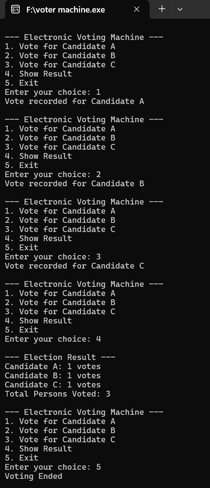

# Voting Machine using C

This project implements a simple electronic voting machine using the C programming language.
It allows users to vote for candidates, counts votes accurately, and displays the total number
of persons who voted.

## Features
- Menu-driven voting system
- Vote counting for multiple candidates
- Displays total number of voters
- Simple and user-friendly interface

## Output
The following screenshot shows the execution of the voting machine program.

## Concepts Used
- switch-case
- while loop
- Variables and counters
- Menu-driven programming

## Author
Varun Kumar S
